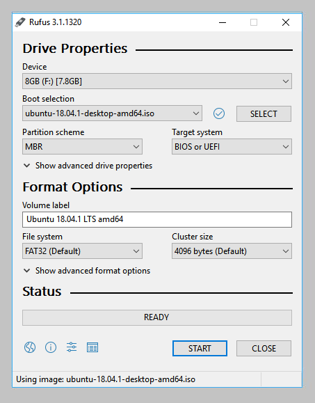
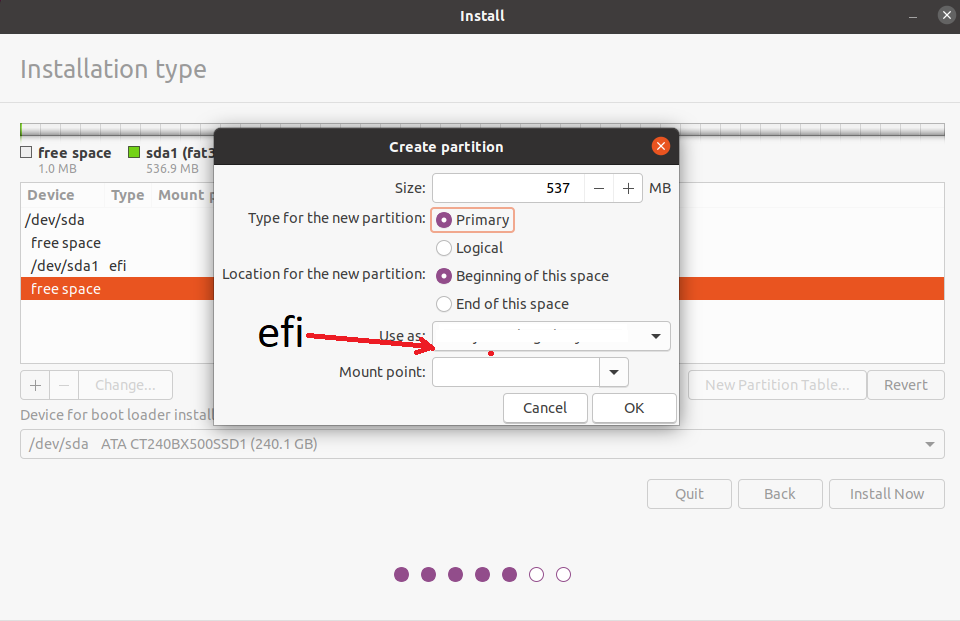
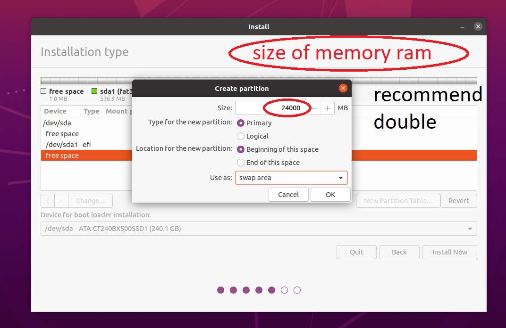
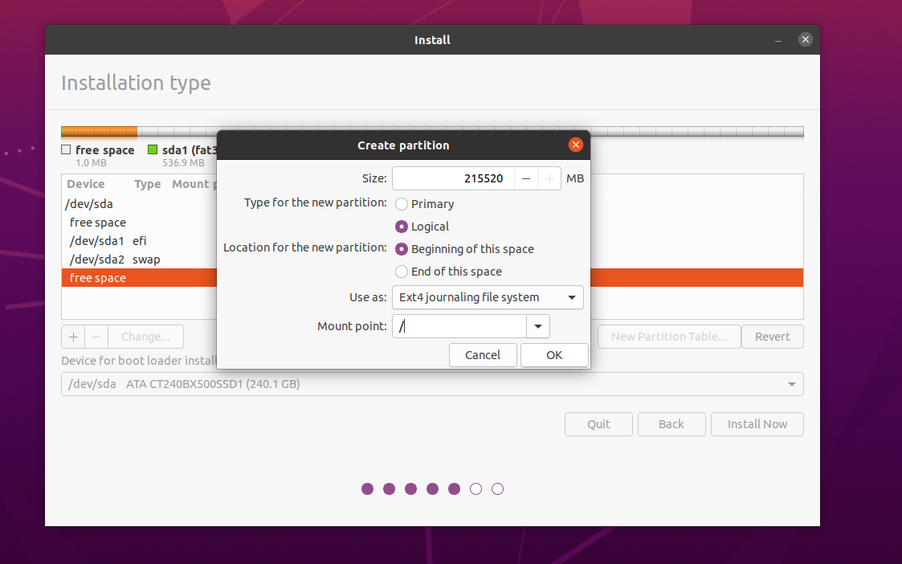

# Linux-Zsh-GNU-Ubuntu-config-development 
  - (GNU=Ubuntu config)(Linux=[terminal,zsh]) - RUFUS

  <p align="center">
    <a href="#">
      
    </a>
    <h3 align="center">Configuration development - NodeJs | ReactJs | React-Native </h3>
  </p>

1. mount pendrive boot with gpt
   * obs: due to the new 9th generation processors and processes, we must use the following pen drive boot configurations using the rufus, important
   - select **(GPT) partition scheme

    <p align="center">
      
    </p>
    <br/>
   - select **(GPT) partition scheme

    <p align="center">
      
    </p>
    <br/>
   - in partition manager select steps select type instalation size(32mb~=550mb)type-partition(primary)Use as EFI()
    <p align="center">
      
    </p>
    <br/>
   - create second partition swap this partition manager bootloader in your system Use as(swap), type(Primary) size:double memory ram
    <p align="center">
      
    </p>
    <br/>
   - create root partition / <- root partition memory total
    <p align="center">
      
    </p>
    <br/>
<hr/>

2. Install zsh
   - Update the packages
      - ```sudo apt update```
   - Install zsh
      - ```sudo apt install zsh```
   - Install curl 
     - ```sudo apt install curl```
   - Install git
     - ```sudo apt install git-all```
   - Zsh default terminal
     - ```chsh -s $(which zsh)```
   - Install Firacode font
     - download in repository
       - ```https://github.com/tonsky/FiraCode```   
   - Install Oh my zsh
     - ```sh -c "$(curl -fsSL https://raw.githubusercontent.com/ohmyzsh/ohmyzsh/master/tools/install.sh)"```
   - Install SpaceshipTheme
     - clone reposiory in ~
       - ```git clone https://github.com/denysdovhan/spaceship-prompt.git "$ZSH_CUSTOM/themes/spaceship-prompt"```
       - linking repository
   - Theme dracula in terminal
     - This theme can be installed on Gnome 3 terminal and any other Gnome based terminal program like the Unity terminal bundled with Ubuntu.
     - You'll need the dconf command (if you run a recent Gnome version). In Ubuntu,this can be installed by running:
       - ```sudo apt-get install dconf-cli```
     - In other distros you'll need to dig around to find it, search your repositories for dconf related packages.
     - After installing dconf, you can clone this repository to your machine.
       - ```git clone https://github.com/dracula/gnome-terminal```
     - Then you can run the installation script:
       - ```./install.sh```

   - Install spaceship
     - run command
       - ```git clone https://github.com/denysdovhan/spaceship-prompt.git "$ZSH_CUSTOM/themes/spaceship-prompt"```
     - run command
        - ```ln -s "$ZSH_CUSTOM/themes/spaceship-prompt/spaceship.zsh-theme" "$ZSH_CUSTOM/themes/spaceship.zsh-theme"```
    
   - Instal visual code
     - download visual studio code
       - ```https://code.visualstudio.com/download```
     - open folder download archive
     - run command
       - ```sudo dpkg -i code...```

   - Configure theme zsh
     - in folder ~ with terminal
       - ```code ./.zshrc```
     - in file replace `ZSH_THEME="robbyrussell"`
       - ```ZSH_THEME="spaceship"```
   - Install plugins zsh
     - run comand
       - ```sh -c "$(curl -fsSL https://raw.githubusercontent.com/zdharma/zinit/master/doc/install.sh)"```
       - restart terminal
       - open zshrc add in file
   - ```zshrc
          SPACESHIP_PROMPT_ORDER=(
          user          # Username section
          dir           # Current directory section
          host          # Hostname section
          git           # Git section (git_branch + git_status)
          hg            # Mercurial section (hg_branch  + hg_status)
          exec_time     # Execution time
          line_sep      # Line break
          vi_mode       # Vi-mode indicator
          jobs          # Background jobs indicator
          exit_code     # Exit code section
          char          # Prompt character
          )
          SPACESHIP_USER_SHOW=always
          SPACESHIP_PROMPT_ADD_NEWLINE=false
          SPACESHIP_CHAR_SYMBOL="❯"
          SPACESHIP_CHAR_SUFFIX=" " 
       ```
     - open `.zshrc`, and add file
       - ```
             zinit light zdharma/fast-syntax-highlighting
             zinit light zsh-users/zsh-autosuggestions
             zinit light zsh-users/zsh-completions
          ```
      - restart terminal
    - Install nvm
      - run command
        - ```curl -o- https://raw.githubusercontent.com/nvm-sh/nvm/v0.35.3/install.sh | bash```
      - add file profile enviroment variable nvm past in .zshrc or .bashrc
        - ```
             export NVM_DIR="$([ -z "${XDG_CONFIG_HOME-}" ] && printf %s "${HOME}/.nvm" || printf %s "${XDG_CONFIG_HOME}/nvm")"
             [ -s "$NVM_DIR/nvm.sh" ] && \. "$NVM_DIR/nvm.sh" # This loads nvm
          ```
      - install node 
        - ```nvm install --lts```
      - use node
        - ```nvm use --lts```
    - Install Yarn
      - run comand to add package repository
        - ```curl -sS https://dl.yarnpkg.com/debian/pubkey.gpg | sudo apt-key add -```
      - write file
        - ```echo "deb https://dl.yarnpkg.com/debian/ stable main" | sudo tee /etc/apt/sources.list.d/yarn.list```
      - install yarn
        - ```sudo apt update && sudo apt install --no-install-recommends yarn```
    - Install jdk8
      - add package
        - ```sudo add-apt-repository ppa:openjdk-r/ppa```
      - update packages
        - ```sudo apt-get update```
      - install package
        - ```sudo apt-get install openjdk-8-jdk```
      - install drives x86
        - ```sudo apt-get install gcc-multilib lib32z1 lib32stdc++6```
    - Install Android Stuio
      - download Android Studio.tar.gz
      - extract file in directori `~` where home/user
      - create a file in `~/Android/Sdk`
      - add profile file `.zshrc`
      - add ```export PATH=$PATH:~/android-studio/bin```
      - add in before alias coment ```alias sudo='sudo env PATH=$PATH $@'```
      - run terminal ```studio.sh```
      - not import config
      - send realtory
      - (welcome) next
      - (install type) custom
      - select JAVA_HOME
      - using visual code for open files ```sudo code . --user-data-dir='.'```
      - add variables envoriment in bash/.bashrc file
    - Configure visual code
      - `shift` + `ctrl` + `p` find JSON preferenes
      - ```json
        {
          //Defini o tema e icones
          "workbench.colorTheme": "Dracula",
          "workbench.iconTheme": "material-icon-theme",
          //Aumenta font terminal
          "terminal.integrated.fontSize":14,

          //Configura tamanho e familia da fonte
          "editor.tabSize":2,
          "editor.fontSize": 14,
          "editor.lineHeight": 24,
          "editor.fontFamily": "Fira Code",
          "editor.fontLigatures":true,

          "explorer.compactFolders": false,
          "editor.renderLineHighlight":"gutter",
          "workbench.editor.labelFormat":"short",

          "javascript.updateImportsOnFileMove.enabled":"never",

          "breadcrumbs.enabled":true,
          "editor.parameterHints.enabled":false,
          "typescript.updateImportsOnFileMove.enabled":"never",
          "explorer.confirmDragAndDrop":false,
          "explorer.confirmDelete":false,
          "editor.rulers":[80,120],
          "terminal.integrated.shell.linux": "/bin/zsh",
          "editor.codeActionsOnSave": {
            "source.fixAll.eslint": true
          },
          "emmet.syntaxProfiles": { "javascript": "jsx" },
          "emmet.includeLanguages": { "javascript": "javascriptreact" },
          "files.associations": {
            ".sequelizerc": "javascript",
            ".stylelintrc": "json",
            ".prettierrc": "json"
          },
          "material-icon-theme.folders.associations": {
            "infra": "app",
            "entities": "class",
            "schemas": "class",
            "typeorm": "database",
            "repositories": "mappings",
            "http": "container",
            "migrations": "tools",
            "modules": "components",
            "implementations": "core",
            "dtos": "typescript",
            "fakes": "mock",
            "websockets": "pipe",
            "protos": "pipe",
            "grpc": "pipe"
          },

          "material-icon-theme.files.associations": {
            "ormconfig.json": "database",
            "tsconfig.json": "tune",
            "*.proto": "3d"
          },
        }
        ```
     - install extensions live shared
       - ```wget -O ~/vsls-reqs https://aka.ms/vsls-linux-prereq-script && chmod +x ~/vsls-reqs && ~/vsls-reqs```
<hr/> 

3. install docker,docker-compose, docker-machine
   * update packages linux
     - ```sudo apt-get update```
   * **(opcional) case remove oldest versions** 
     - ```sudo apt-get remove docker docker-engine docker.io```
   * install docker package
     - ```sudo apt install docker.io```
   * Start and Automate Docker, the Docker service needs to be setup to run at startup. To do so, type in each command followed by enter
     - ```sudo systemctl start docker```
     - ```sudo systemctl enable docker```
     - Create the docker group if it does not exist
     - ```sudo groupadd docker```
     - Add your user to the docker group.
     - ```sudo usermod -aG docker $USER```
     - Run the following command or Logout and login again and run (that doesn't work you may need to reboot your machine first)
     - ```newgrp docker```
     - Check if docker can be run without root
     - ```docker run hello-world```
   * Testing success
     - ```docker --version```
   * Referencies
     - ```https://www.digitalocean.com/community/questions/how-to-fix-docker-got-permission-denied-while-trying-to-connect-to-the-docker-daemon-socket```

   * **Optional**
   * Install docker-compose 
     - ```sudo apt install docker-compose```
   * Install docker-machine
     - ```
          base=https://github.com/docker/machine/releases/download/v0.16.0 &&         
          curl -L $base/docker-machine-$(uname -s)-$(uname -m) >/tmp/docker-machine &&
          sudo mv /tmp/docker-machine /usr/local/bin/docker-machine &&
          chmod +x /usr/local/bin/docker-machine
       ```
   * testing 
     - ```docker-machine version```
   * create machine default
     - install virtual-box
       - ```sudo apt-get install virtualbox```
     - isntall machine default -d second plan, 
       - ```docker-machine create -d virtualbox temp.sysadmin.local```
       - path
         - ```eval $(docker-machine env temp.sysadmin.local)```
         - ```docker-machine env temp.sysadmin.local ```
     - initial machine default
       - ```docker-machine start default```
   * Back Docker-LocalMachine return enviroment variable
     - este comando troca para o docker local
     - ```eval "$(docker-machine env -u)"```
<hr/>
   
   - **Comands commons que salvam xD** 
   - git
     - access develop
       - ```git checkout branch_name```
     - run 
       - ```git pull```
     
     - back to branch
       - ```git checkout branch_name```
     - run git merge develop
       - ```git merge branch_name```
   - Node
     - kill process nodeJs
       * case netstat command not found
         - ```sudo apt-get install net-tools```
       - see a process in port
         * ```sudo netstat -lpn |grep :'3000'```
       - kill the id process without aspas
         * ```kill -9 id_process```
   
   - Problems with emulator in projects react-native, when install dependencia, or bundle not start
      - Register bundle
        - ```npx react-native bundle --platform android --dev false --entry-file index.js --bundle-output android/app/src/main/assets/index.android.bundle --assets-dest android/app/src/main/res/```
      - reset cache
        - ```cd android;./gradlew clean;cd ..;npx react-native run-android;npx react-native start --reset-cache;```
      - link assets
        - ```npx react-native link```
   - Force kill process
     - alt + f2
     - click in program 
